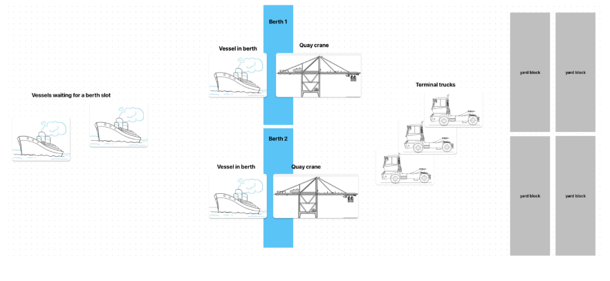

# MaerskCaseStudy

## Case Study - Simulating a Container Terminal

---

**Process:**

- Unloading containers from vessels
- Loading containers onto trucks

**Resources:**

- Berths: 2
- Trucks: 3
- Cranes: 2

**Events:**

- Request for berth
- Request for truck
- Request for crane

**Environment:**

- Container terminal with limited resources (berths, cranes, and trucks) operating in parallel.

---

## How it approached

### 1. Scenario of Vessels and Berths

Vessels arrive with a probability that follows an exponential distribution with an average interval of 5 hours (300 minutes). The process is as follows:

1. **Arrival:** Vessels arrive at the terminal and note their arrival time.
2. **Berth Request:**
   - If all berths are occupied:
     - Vessels wait for a berth to free up.
     - Once a berth is available, the vessel at the front of the queue is allocated the berth.
     - The vessel notes its berthing time.
     - The process of unloading containers begins.
     - The vessel leaves the berth after unloading.
   - If a berth is available immediately:
     - The vessel notes its berthing time.
     - The vessel at the front of the queue is allocated the berth.
     - The process of unloading containers begins.
     - The vessel leaves the berth after unloading.

### 2. Scenario of Containers and Cranes: Unloading Containers

All containers, numbered from 1 to 150, follow this process:

1. **Crane Request:**
   - Containers queue up and request a crane (2 cranes available).
   - If a crane is available:
     - The crane picks a container from the front of the queue.
     - The crane takes 3 minutes to move the container and waits for a truck.
     - The process of loading the container onto a truck begins.
   - If no crane is available:
     - Containers wait for a crane to free up.

### 3. Scenario of Cranes and Trucks: Loading Containers onto Trucks

Cranes request trucks (3 trucks available) for service, with each truck taking 6 minutes per container:

1. **Truck Request:**
   - If at least one truck is available:
     - The crane at the front of the queue gets a truck.
     - The truck takes 6 minutes to transport the container to the yard block and return.

## Flow Diagram



```plaintext
Vessel Arrival
    |
    v
Request for Berth
    |
    v
Berth Available? ----> No ----> Wait for Berth
    |                           |
   Yes                          |
    |                           |
    v                           v
Note Berthing Time        Allocate Berth to Vessel in Queue
    |
    v
Unload Containers
    |
    v
Request for Crane
    |
    v
Crane Available? ----> No ----> Wait for Crane
    |                        |
   Yes                       |
    |                        |
    v                        v
Move Container (3 mins)  Allocate Crane to Container in Queue
    |
    v
Request for Truck
    |
    v
Truck Available? ----> No ----> Wait for Truck
    |                       |
   Yes                      |
    |                       |
    v                       v
Load Container onto Truck Allocate Truck to Crane in Queue
    |
    v
Truck Transports Container to Yard (6 mins)
```

This case study outlines the simulation of a container terminal, emphasizing the flow of resources and processes within the environment. The simulation accounts for vessel arrivals, the allocation of berths, cranes, and trucks, and the sequential unloading and loading of containers.
